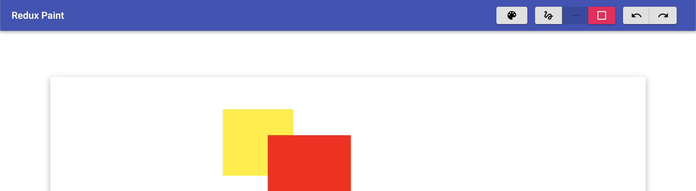

# Redux Paint


Simple "time traveling" paint application. [Example](http://www.jamesmoriarty.xyz/redux-paint/).



## Development

```
npm start
```

## Test

```
npm test
```

## Deploy

```
npm run deploy
```
